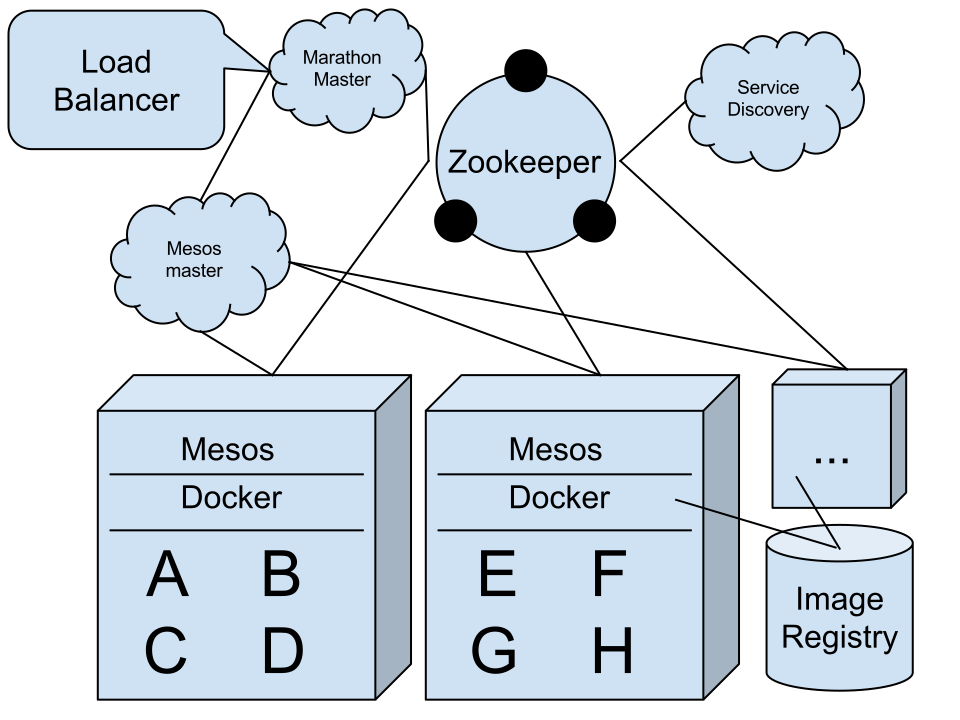
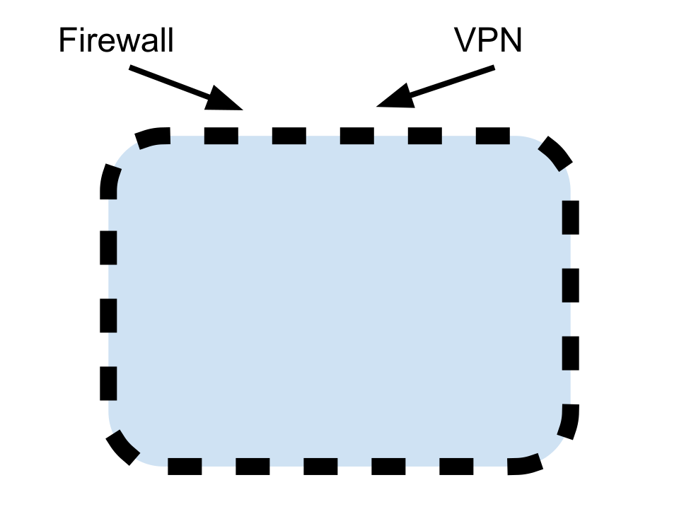
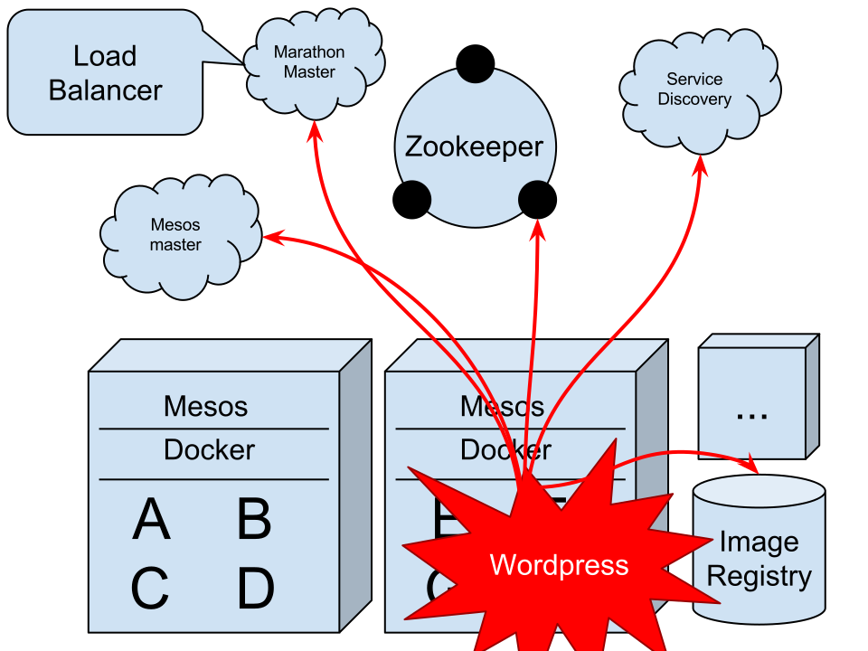
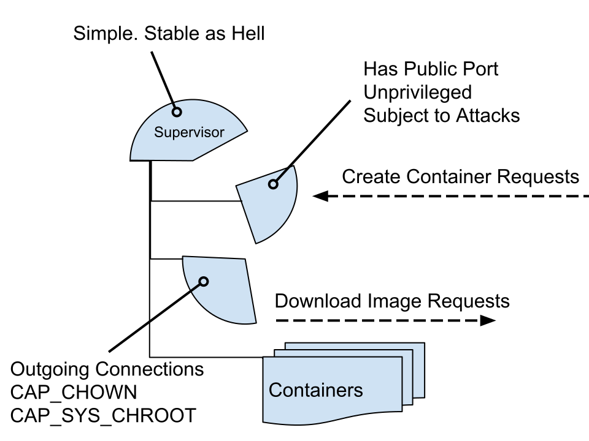

:css: my.css
:js: my.js

.. title:: Linux Containers Ecosystem

----

==========================
Linux Containers Ecosystem
==========================

----

:data-scale: 2
:data-x: 500
:data-y: 0

----

:id: internals
:data-x: 1000
:data-y: -500
:data-scale: 1

Internals
+++++++++

----

:data-x: r2000
:data-y: r-1000

Process Management
==================

----

:data-x: r2000

The most obvious way:

.. code-block:: python

   proc = subprocess.Popen(...)
   proc.wait()

----

Low level API:

.. code-block:: python

    pid = os.spawnve(os.P_NOWAIT, ...)
    os.waitpid(pid, 0)

----

Even more low level:

.. code-block:: python

    pid = os.fork()
    if pid == 0:
        os.execve(...)
    assert pid > 0, "Fork failed"
    os.waitpid(pid, 0)

----

``fork()`` at system call level (``strace``)::

    clone(child_stack=0,
        flags=CLONE_CHILD_CLEARTID|CLONE_CHILD_SETTID|SIGCHLD,
        child_tidptr=0x7fcd0e8539d0) = 8697

----

Finally namespaces (bad example!):

.. code-block:: python
    :class: part1

    import signal, ctypes, os

    libc = ctypes.CDLL('libc.so.6', use_errno=True)
    CLONE_NEWPID = 0x20000000
    CLONE_NEWUSER = 0x10000000
    stack = ctypes.byref(ctypes.create_string_buffer(0x200000), 0x200000)

.. code-block:: python
    :class: part2

    CHILDFUNC = ctypes.CFUNCTYPE(ctypes.c_int, ctypes.c_void_p)
    @CHILDFUNC
    def childfunc(_):
        print("CHILD", "pid:", os.getpid(), "uid:", os.getuid())
        return 0

.. code-block:: python
    :class: part3

    pid = libc.clone(childfunc, stack,
        CLONE_NEWPID|CLONE_NEWUSER|signal.SIGCHLD, 0)
    assert pid > 0, "Clone error"
    print("PARENT", "pid:", os.getpid(),
        "uid:", os.getuid(), "child:", pid)
    os.waitpid(pid, 0)

----

:id: clone_part1
:data-x: r100
:data-y: r-50
:data-scale: 0.7

----

:id: clone_part2
:data-x: r0
:data-y: r100

----

:id: clone_part3
:data-x: r0
:data-y: r150

----

:data-x: r2000
:data-scale: 1

Output (the order of lines is arbitrary)::

    $ python3 clone.py
    PARENT pid: 14305 uid: 1000 child: 14306
    CHILD pid: 1 uid: 65534

----

Namespaces:

* CLONE_NEWIPC
* CLONE_NEWNET
* CLONE_NEWNS
* CLONE_NEWPID
* CLONE_NEWUTS
* CLONE_NEWUSER

----

But there is ``chroot`` since 1993!

----

:id: fs_table

+--------------------------+----------+
|/var/lib/lxc/ubuntu/rootfs|          |
+--------------------------+----------+
|                          | * /usr   |
|                          | * /var   |
|                          | * /dev   |
|                          | * ...    |
+--------------------------+----------+
|/var/lib/lxc/nix/rootfs   |          |
+--------------------------+----------+
|                          | * /nix   |
|                          | * /run   |
|                          | * ...    |
+--------------------------+----------+

----

With root privileges you can just:

.. code-block:: python

   os.chroot('/var/lib/lxc/ubuntu/rootfs')

----

CLONE_NEWNS
===========

mount namespaces

available in 2.4.19 (2003)

----

``mount --bind``

available in 2.4.0 (2001)

----

Create hierarchy in new mount namespace:

.. code-block:: bash

    mount --bind /var/lib/lxc/ubuntu/rootfs \
                 /usr/lib/lxc/rootfs
    mount --bind /dev \
                 /usr/lib/lxc/rootfs/dev
    mount -t tmpfs tmpfs /usr/lib/lxc/rootfs/tmp
    # note /var/lib/lxc/ubuntu/rootfs/{dev,tmp} still empty
    chroot /usr/lib/lxc/rootfs bash

----

CLONE_NEWPID
============

* own pid 1
* ``KILL``'ed when pid 1 dead
* separate ``/proc``
* ``SIG_IGN`` for ``SIGTERM`` and friends

----

CLONE_NEWIPC
============

* semaphores
* message queues
* etc.

----

CLONE_NEWUTS
============

* ``hostname``

----

CLONE_NEWNET
============

* network interfaces
* iptables rules
* localhost

-----

CLONE_NEWNET
============

useful on its own using ``ip netns``

-----

CLONE_NEWUSER
=============

containers by unprivileged users

----

:data-scale: 2
:data-x: 500
:data-y: 0

----

:id: tools
:data-x: 1000
:data-y: 0
:data-scale: 1

Tools
+++++

----

:data-x: r2000

LXC
===

looks like good old virtualisation

----

LXC
===

* slow to setup
* slow to start
* complex administration

----

LXC
===

* system bloat: SSH, upstart, cron ...
* bridged network
* complex (but powerful) config

----

LXC
===

But:

* lxc-create --t download
* lxc-exec

----

Docker
======

* easy to run
* easy to create image
* easy to deploy
* docker push

----

.. class:: strikethrough

::

    docker run ubuntu bash

::

    docker run -it --rm \
        --user $(id -u)
        --volume $(pwd):/workdir \
        --workdir /workdir \
        our.repo.local/foobar:$(get_version) \
        bash

----

Docker
======

buggy

----

Docker
======

* complicated security
* hates upstart/systemd/mesos...

----

Vagrant-LXC
===========

Has over LXC:

* download/upload images
* provisioning

----

Vagrant-LXC
===========

* compatible with VirtualBox
* cheaper than VM

----

Vagrant-LXC
===========

* slow to start
* only for dev.env.

----

systemd-nspawn
==============

* equivalent of lxc-exec
* no tools to build images
* complex config

----

Vagga
=====

* simple YAML config (+versioning)
* user namespaces (no root/setuid)
* multiple process monitoring
* only for dev.env.

----

.. code-block:: yaml

    # vagga.yaml
    containers:
      'react':
        builder: npm
        parameters:
          packages: react-tools
    commands:
      'build':
        container: react
        description: "Build static files"
        run: "jsx jsx/page.jsx > public/js/page.js"

----

.. code-block:: console

    $ git clone git://github.com/.../foobar
    $ cd foobar
    $ vagga
    Available commands:
        build       Build static files
        run         Run nginx+app+redis
        build-docs  Build docs
    $ vagga build

----

::

   # docker tree
   -+= 00001 root systemd --system
    |-+- 10771 root docker -d
    | \--= 32029 root bash   << our process
    \-+= 30029 pc tmux
      \-+= 10718 pc -zsh     << our shell
        \--= 32021 pc docker run -it --rm bash

::

   # vagga tree
   -+= 00001 root systemd --system
    \-+= 30029 pc tmux
      \-+= 10358 pc -zsh        << our shell
        \-+= 00940 pc vagga bash
          \-+- 00941 pc vagga bash
            \--= 00942 pc bash  << our process

----

* http://github.com/tailhook/vagga
* http://vagga.readthedocs.org

----

Nix
====

* not-a-virtualisation
* virtualenv for C, Py, Node, ...

----

coreutils
=========

* ``unshare``
* ``nsenter``

(+ ``mount`` and ``bash``)

----

:data-scale: 2
:data-x: 500
:data-y: 0

----

:id: security
:data-scale: 1
:data-x: 1000
:data-y: 500

Security
++++++++

----

:data-x: r2000
:data-y: r1000

Running as Root
===============

    ... we don’t claim Docker out-of-the-box
    is suitable for containing untrusted
    programs with root privileges ...

    -- Solomon Hykes

----

:data-x: r2000

Running as non-Root
-------------------

.. code-block:: bash

    docker run -it --rm --user=1000 something

----

:id: docker_root_lie
:data-x: r0

.. class:: lie

Lie

----

:data-x: r2000

Can become root by any binary with setuid set:

(e.g. ``su``, ``sudo``)

So can be broken on untrusted images

(e.g. by replacing ``/etc/sudoers``)

----

Docker
------

* Always use ``--user=``
* Never use untrusted images

----

Root in LXC
-----------

* same as docker
* except unsafe defaults
* running processes: ssh, crontab

----

Root in User Namespaces
-----------------------

* Allows safely "be root"
* Has uid > 0 outside namespace
* Supported by LXC and Vagga
* Eventually supported in Docker

----

Docker Socket
=============

----

Docker command workflow:

``docker run ubuntu bash``

--> HTTP --> /var/run/docker.sock -->

``docker -d``

----

Docker socket permissions::

    srw-rw---- 1 root docker Oct  7 23:23 /var/run/docker.sock

Which is basically equivalent to::

    %docker ALL=(ALL) NOPASSWD: ALL

----

In case it's not obvious::

    docker run -it --rm \
        --privileged \
        --volume /:/host \
        ubuntu rm -rf /host

----

Never run::

    docker -d -H 127.0.0.1

(any hostname, even localhost)

Without::

    docker -d --tlscacert --tlsverify

----

But that's not enough!

----

SkyDock
-------

* Service discovery for docker
* Listens docker events
* Publishes them as DNS records

----

Running as::

    docker run -d \
    -v /var/run/docker.sock:/docker.sock \
    crosbymichael/skydock

----

breaking skydock

=

breaking host system

----

Don't Let Service Discovery Create Containers!
==============================================

----

Breaking Clusters
=================

----

:data-scale: 0.5

----

:id: docker_cloud_firewalled
:data-scale: 1
:data-x: r0
:data-y: r-50

----

:data-x: r2000

----

* Use ACLs in Zookeeper
* Use Auth *and* Firewall
* Don't trust local machines

----

Untrusted Images
================

* setuid binaries
* networking code
* DoS

----

Insufficently Authenticated Repositories
========================================

.. note:: Repository is accessible (rw) by developers and production IPs.
   Developer has set simple password.

----

Can replace any image:

* load-balancer
* service-discovery
* statistics

----

:id: perfect

*Perfect* Virtualisation **Tool**
=================================

----

Volumes
-------

Limit mountable directories

Say *NO* to mounting host root!

----

Volumes
-------

Base image:

``/containers/{skydock,wordpress}``

* read-only
* nosuid, nodev

----

Volumes
-------

Storage:

``/var/lib/{mysql,redis,postgres}``

* writable
* noexec, nosuid, nodev

----

Volumes
-------

``*`` can be done for Docker using Apparmor or SELinux

----

Users
-----

Never run anything as root

----

Images
------

* Signing
* Incremental Download

----

----

:data-scale: 2
:data-x: 500
:data-y: 0

